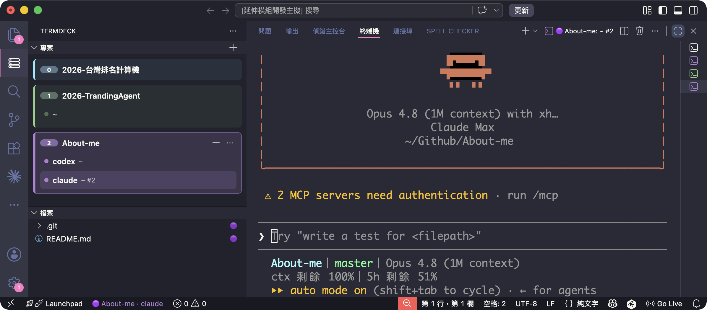

# TermDeck

在同一個 VSCode 視窗裡跨專案管理多個終端機（Claude / Codex 等 session）——一個專案 × 多個終端機的控制台。



Activity Bar 最左側新增一個容器，內含兩個面板：

- **Projects**（webview）：每個專案是一張**單行卡片**——最左是 **terminal 數徽章**、接著專案名稱，hover 顯示 **＋（開 terminal）** 與 **⋯（更多：設色 / 改名 / 移除）**；卡片有左側色條 + 淡底色，當前專案高亮。底下是該專案的 terminal 群組。
- **Files**（原生樹）：顯示**當前專案**的檔案樹，保留 VSCode 原生檔案圖示；點檔開檔，任何資料夾可「在此開 terminal」。**把資料夾拖到這裡即可加入為新專案。**

切換專案只是聚焦，不會 reload 視窗，所以**所有 terminal 全程不中斷**。

## 功能

- **專案 = 色塊卡片**：跨視窗持久化（存在 globalState），背景色塊 + 分隔線快速辨識；每個專案一個顏色。
- **terminal 群組**：每個專案的 terminal 集中在卡片內，一鍵開啟 / 聚焦 / 關閉。
  - **顯示執行中的指令**：跑 `claude` / `codex` 等時，卡片內該 terminal 標籤顯示指令名稱、左側圓點**脈動**，專案的數量徽章也會脈動標示「有指令在跑」；結束後還原。需 VSCode shell integration 啟用（bash/zsh/pwsh/fish 預設開）。
  - **分頁色帶**：原生終端機分頁名稱前帶該專案的 emoji 色圓點（如 `🔵 my-app: src`）+ 圖示染色，標示所屬群組。
- **拖曳加入專案**：把資料夾拖到 **Files 面板**即可新增為專案（可靠，Finder 與檔案總管都支援）；也可拖到 **Projects 卡片**（盡力，較新版 VSCode 受 webview 限制取不到路徑時會提示改拖到 Files）。
- **檔案瀏覽**：Files 面板是當前專案的檔案樹，點檔開檔；任何資料夾 hover 可「在此開 terminal」（cwd 設在該子目錄）。
- **切換即聚焦**：點專案卡片會帶出最近一個 terminal、Files 面板也切到該專案（**不會搶焦點跳到檔案總管**）。預設**不**改動 workspace（避免空視窗首次開啟時 reload 導致 terminal 被重置）；需要原生 Explorer / Git 時可用 `projectSwitch.addToWorkspace` 開啟，把專案掛進 multi-root workspace。
- **啟用的 terminal 強調**：目前聚焦的 terminal 在卡片內會高亮（左側色條 + 不透明），其餘淡化，方便辨識。
- **介面**：卡片動作用 codicon SVG 圖示（非 emoji）；關閉鈕固定靠右。
- **自選顏色**：設定專案顏色（卡片動作按鈕或指令），六色調色盤 🔴🟠🟡🟢🔵🟣，或改回「自動」依名稱配色。
- **檔案以色圓點標示（不染文字）**：每個專案底下的檔案會在右側顯示該專案的 emoji 色圓點（Files 樹、原生 Explorer、編輯器分頁都會），一眼分辨檔案屬於哪個專案，但不改變檔名文字顏色。
  - 編輯器分頁要看到圓點，需開啟設定 `workbench.editor.decorations.badges: true`（預設開啟）。
- **與原生終端機列表連動**：在原生終端機分頁點到某個 terminal，Project 面板會自動高亮它所屬的專案（VSCode 無法把原生分頁分組成資料夾，故以命名 + 顏色 + 連動整合）。
- **狀態列指示器**：底部狀態列顯示當前 terminal 所屬專案的彩色晶片「🔵 專案名 · claude」，跟著聚焦的 terminal 即時切換（終端機內容區由 xterm 渲染、無法加色帶，故以狀態列指示）。
- **多語系**：介面支援英文與繁體中文，依 VSCode 顯示語言自動切換。
- **可設定行為**：
  - `projectSwitch.onProjectClick` — `focusOrStartSession`（預設）/ `focusOnly` / `alwaysNewSession`
  - `projectSwitch.addToWorkspace` — 開專案時是否把資料夾加進 workspace（**預設 `false`**：保持乾淨、不 reload；開啟可取得原生 Explorer / Git / 全域搜尋）
  - `projectSwitch.autoStartClaude` — 開 terminal 時是否自動執行 Claude（**預設 `false`**，只開乾淨 terminal）
  - `projectSwitch.claudeCommand` — 自動執行時的指令（預設 `claude`，可改 `claude --resume` 等）

## 開發 / 試用

```bash
npm install
npm run watch     # esbuild 監看；或 npm run build 做一次性建置
```

在 VSCode 開啟本資料夾後按 **F5** 啟動 Extension Development Host，左側即會出現 Projects 面板。

型別檢查：`npm run compile`。打包：`npm run package`（產生 `.vsix`，可用 `code --install-extension *.vsix` 安裝）。

## 架構說明

Projects 面板用 **webview** 自繪（背景色塊、分隔線、terminal 群組是原生 TreeView 做不到的）；Files 面板維持**原生 TreeView**（保留檔案圖示主題與專案染色），並掛了拖放控制器接受資料夾 drop 來新增專案。兩者透過 message / 共用 actions 串接。介面字串以 VSCode `l10n`（執行期）與 `package.nls`（貢獻點）做英／繁雙語。

已知限制：
- VSCode 不允許改「已開啟」terminal 的原生分頁顏色，故換色時面板即時更新、但已開的原生分頁維持原色（新開的才用新色）。
- webview 在較新版 VSCode（Electron 已移除 `File.path`）無法取得 OS 拖入資料夾的絕對路徑，故可靠的拖曳落點是原生 Files 面板。

未納入（future）：`claude --resume` 自動還原、terminal running/idle 狀態細分、卡片拖曳排序。
